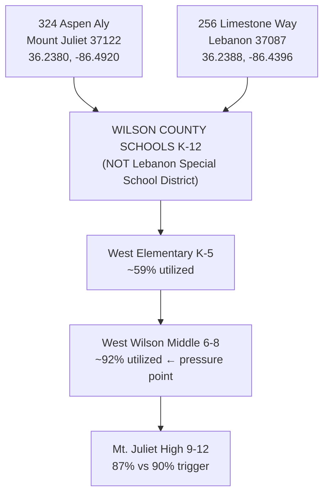
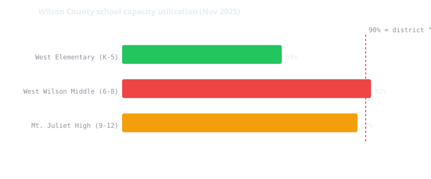
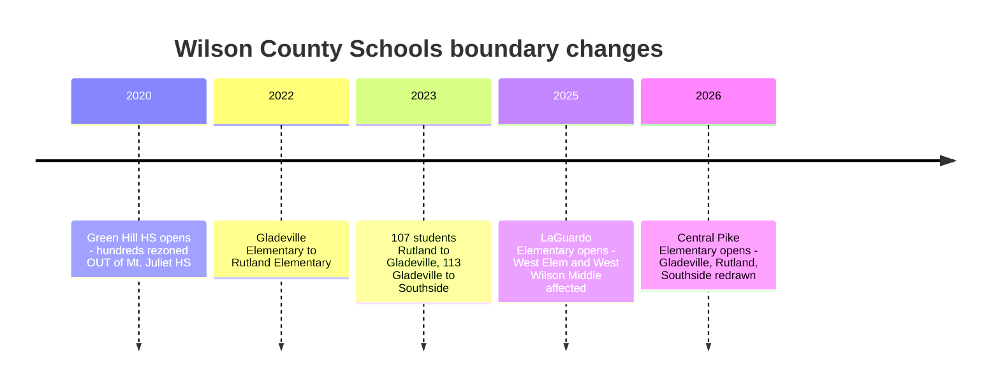
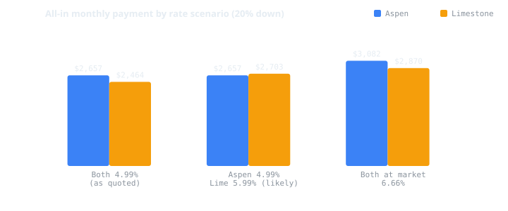
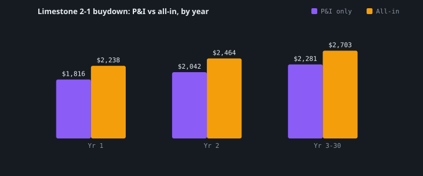
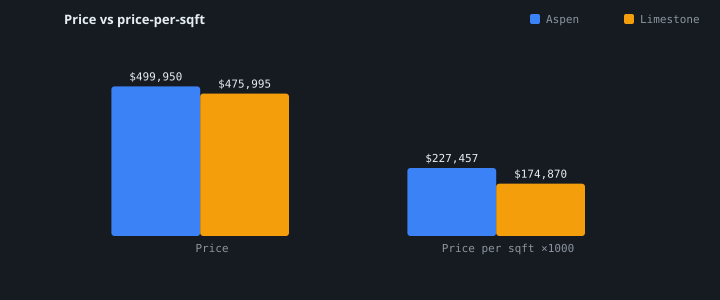
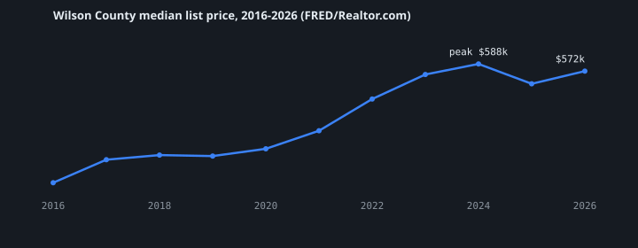
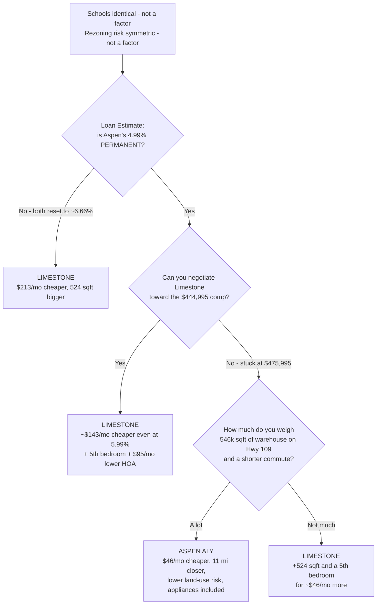

# 324 Aspen Aly vs 256 Limestone Way — End-to-End Analysis

_Generated 2026-08-31. Research by four parallel agents (listings/comps, schools, rezoning, market/hazard). Every figure is sourced; confidence is labelled. See [`data.json`](./data.json) for machine-readable output and [`SOURCES.md`](./SOURCES.md) for the full source list._

---

## TL;DR

**Schools are not a differentiator. They are literally the same three schools.** That was your primary decision criterion, and it is settled by the school district's own address-level lookup. The decision reduces to money, land-use risk, and commute.

**The one thing that decides this purchase is a document you don't have yet: a Loan Estimate from each builder's lender.** Your quoted 4.99% is a builder incentive, not a market rate (market is 6.66%), and Ashton Woods publishes a **2-1 buydown** whose year-2 step is exactly 4.99% — meaning Limestone Way's real long-run rate is likely **5.99%**. That single fact flips the answer.

| | 324 Aspen Aly | 256 Limestone Way |
|---|---|---|
| City | **Mount Juliet 37122** (not Lebanon) | Lebanon 37087 |
| Price | **$499,950** (not $470,000) | **$475,995** |
| Size | 2,198 sqft, 4bd/3ba | **2,722 sqft, 5bd/3ba** |
| $/sqft | $227.46 | **$174.87** |
| HOA | $145/mo | **$50/mo** |
| Schools | West Elem → West Wilson Middle → Mt. Juliet High | **identical** |
| Land-use risk | MEDIUM | **HIGH** |
| Commute to Nashville | **19 mi** | 31 mi |
| Appliances | **fridge + washer/dryer + blinds included** | none |
| Likely 30-yr rate | 4.99% (unconfirmed) | **5.99%** (2-1 buydown) |

---

## 1. Your premises were wrong in four places

These corrections change the math, so they come first.

| What you said | What the evidence shows | Confidence |
|---|---|---|
| Both in Lebanon 37087 | **324 Aspen Aly is in Mount Juliet 37122** (Benders Cove, Meritage Homes). Different city, different municipal tax rate, different commute. | High |
| Aspen Aly = $470,000 | **$499,950** on Meritage's own page (Redfin cached $523,450, so it appears price-reduced). $470k is below Meritage's published Premier Series floor of $473,990. | Medium-High |
| Aspen Aly ≈ 2,150 sqft | **2,198 sqft** ("Palmetto" plan) | High |
| Limestone price unknown | **$475,995** builder / **$469,995** MLS, **2,722 sqft** ("Bartlett" plan), Ashton Woods, MLS 3276727 | High |

Any monthly payment you were quoted on a $470,000 Aspen Aly is wrong by ~$30,000 of principal.

---

## 2. Schools — zero difference, settled by primary source

The Schools agent bypassed builder marketing (which is routinely stale) and queried **Wilson County Schools' own address-level attendance lookup** (Transfinder InfoFinder i, district client ID `WCS5MDPRFWQV`). Both addresses returned `exactAddressMatch: true`, score 100.

The two homes sit **~2.9 miles apart on the same latitude**. The 37087 vs 37122 split is *postal, not jurisdictional* — the district's own address record even carries Limestone Way as 37122. Both have named district bus stops (Benders Ferry Rd & Moss Creek Blvd; Limestone Way & Emerald Blvd).

**Every proficiency score, growth measure, capacity ratio and rating is identical by construction, because it is the same three buildings.**

| | West Elementary | West Wilson Middle | Mt. Juliet High |
|---|---|---|---|
| Utilization | ~59% | **~92%** | 87% |
| Math proficient | 64% | 49% | 42% |
| Reading proficient | 60% | 49% | 57% |
| Third-party (soft) | top 10% of TN schools | 41st of 583 TN middle schools, 5-star | better than 83.3% of TN high schools |

District graduation rate **98.5%**; of 23 A–F-eligible WCS schools: 8 A, 8 B, 6 C, 1 D, no F.

Two corrections logged during research: **jome.com's claim that Benders Cove feeds Mt. Juliet Middle is wrong** (refuted by the official lookup), and an earlier hypothesis that Limestone Way had been rezoned to LaGuardo Elementary is **not supported** — the authoritative lookup returns West Elementary for both.

---

## 3. School rezoning risk — real, but symmetric

Your instinct that rezoning is a live risk is **correct**. Your instinct that it distinguishes these two homes is **not**.

Wilson County Schools has made **four board-approved boundary changes in five years** — roughly annual — and **every new school opening has triggered one**.

**Why it cannot favor either home:** both share the identical triad, so no boundary change at West Elementary, West Wilson Middle, or Mt. Juliet High can hit one house and spare the other. WCS moves **whole subdivisions together** by stated policy.

**Where the pressure actually is:**
- **West Wilson Middle ~92%** — a post-tornado replacement building whose own district finance projection had it at 1,560 students against 1,500 core capacity, i.e. **over capacity on opening**. Leadership publicly called it "at capacity or near capacity" in Oct 2025.
- **Mt. Juliet High 87%** against the district's explicit **90% "start planning a new school"** trigger — and there is **no new high school approved, funded, or under construction**. The only funded projects (Watertown Middle, Lakeview) are 2028-29 and on the far side of the county.
- **None of the three schools appears in the approved 2026-27 rezonings.** Near-term risk is low; a 3–7 year window is a genuine exposure.

**Uncomfortable irony worth stating plainly:** both subdivisions are still actively building out (~350 homes entitled at Benders Cove, 660 at Golden Bear Place, +92 at Silver Springs; Cades Bluff has 6 active / 7 under contract with phases still releasing). The rezoning risk you're worried about is **being manufactured by the very developments you're choosing between**.

**Grandfathering is not policy.** It's discretionary and case-by-case: terminating-grade students and siblings have typically been *offered* a choice to stay, sometimes requiring an application.

---

## 4. Land use — this is the real differentiator, and it favors Aspen Aly

Once schools cancel out, the risk that actually separates these homes is what gets built **next door**.

### 256 Limestone Way — HIGH risk (Hwy 109 corridor)

Hwy 109 is Lebanon's de facto industrial/distribution corridor:

- **A 254-unit apartment complex is already built directly adjacent** (Reunion Township @ 109, 550 Old Laguardo Rd W, 27 acres, 2024). Not a proposal — built.
- **~546,000 sqft warehouse park approved** on 56 acres between Hwy 109 and Franklin Rd (Lebanon Commerce Center, 3 buildings, Building 1 alone 297,907 sqft with ~40 loading docks). Plats approved June 2025.
- **Two live commercial rezonings on Hwy 109 N**: 5780 Hwy 109 N (C-3→C-2, pending on the county agenda 17 Jun 2026); 1635 Hwy 109 N (R-1→C-1).
- **An ICE detention facility was proposed on this corridor in Feb 2026** before being withdrawn — evidence the corridor is a live target for institutional siting.
- Lebanon's own mayor is on record objecting: _"I did not want Lebanon to become the distribution center capital of the world… when is enough, enough?"_ — while council keeps approving on split votes.

### 324 Aspen Aly — MEDIUM risk (Lebanon Rd corridor)

Commercializing toward **retail and mixed-use residential**, which is materially less value-suppressing than dock-door warehouse: Golden Bear Place (660 homes mixed-use), a convenience store/fuel station rezoning, Silver Springs (+92 homes), and Lebanon Rd widening from 2 to 5 lanes.

---

## 5. The money

### The rate is the whole ballgame

Market 30-year fixed is **6.66%** (Freddie Mac PMMS, week of 2026-08-27). A 4.99% quote is ~167 bps below market and **cannot be a standard rate** — it is a builder buydown.

| Builder | Published incentive | What your "4.99%" probably is |
|---|---|---|
| Meritage (Aspen) | "as low as 4.99% (5.093% APR)" through Oct 31 | Possibly permanent — but Meritage's own FAQ says a buydown _"does not change the permanent note rate… it simply buys down the rate for the first couple of years."_ **UNCONFIRMED.** |
| Ashton Woods (Limestone) | **2-1 buydown: 3.99% yr 1 / 4.99% yr 2 / 5.99% yr 3–30** | **The year-2 step.** Your real long-run rate is likely **5.99%**. |

Ashton Woods' *current* Cades Bluff banner is different again — "as low as 3.25% + $20k in design options" — so the 4.99% you were quoted may already be stale and beatable.

### Monthly, all-in (20% down, incl. tax + insurance + HOA)

| Scenario | Aspen Aly | Limestone Way | Winner |
|---|---|---|---|
| Both 4.99% (as you were told) | $2,657 | **$2,464** | Limestone by **$193/mo** |
| **Aspen 4.99% / Limestone 5.99% — LIKELY** | **$2,657** | $2,703 | **Aspen by $46/mo** |
| Both at market 6.66% | $3,082 | **$2,870** | Limestone by **$213/mo** |

Component detail (likely scenario): Aspen P&I $2,145 + tax $151 + ins $217 + HOA $145. Limestone P&I $2,281 + tax $156 + ins $217 + HOA $50.

### The payment shock nobody mentions

| Period | P&I | All-in |
|---|---|---|
| Year 1 @ 3.99% | $1,816 | $2,238 |
| Year 2 @ 4.99% | $2,042 | $2,464 |
| **Year 3–30 @ 5.99%** | **$2,281** | **$2,703** |

**+$465/mo permanent increase** from year 1 to year 3. Budget from the year-3 number, not the teaser.

### 30-year total cost of ownership

| Scenario | Aspen | Limestone | Δ |
|---|---|---|---|
| Both 4.99% | $1,056,464 | $982,345 | Limestone saves $74,119 |
| **Aspen 4.99% / Lime 5.99%** | **$1,056,464** | $1,068,294 | **Aspen saves $11,830** |
| Both 6.66% | $1,209,689 | $1,128,228 | Limestone saves $81,461 |

### Price per square foot — read this carefully

Limestone is **$174.87/sqft** vs Aspen **$227.46/sqft**. Do not read that as a clean 30% discount, and do not read it as a warning either. Two separate things are going on:

1. **Most of the headline gap is plan size, not a bargain signal.** Larger two-story plans always price lower per foot. This compares a **2,722 sqft** home against a **2,198 sqft** one, which exaggerates the difference. Cades Bluff's own subdivision average is $224/sqft (closed sales, rolling 12 months to Apr 2026) against roughly **$233–239/sqft** across the six current Aspen Aly listings ($271 / $235 / $233 / $235 / $232 / $227) — and those are not even like-for-like, since closed sales lag current list in a rising market.
2. **That few-percent subdivision-level gap is fully explained without invoking corridor risk.** Benders Cove has a pool, dog park, playground and trails behind its $145/mo HOA; Cades Bluff has no amenities and charges $50/mo — amenity value capitalizes directly into price per foot. On top of that, Mount Juliet is a structurally more expensive submarket (median ~$249.75/sqft) because it is closer to Nashville. Nothing is left over that needs the Hwy 109 corridor to explain it.

**Why that matters, and it is not good news.** If the market were discounting Cades Bluff for the warehouse park and the adjacent apartments, the discount would appear **subdivision-wide**, because every lot there shares that exposure. It does not appear. So:

> **The two findings are separate, and both are true:** the per-sqft value on 256 Limestone Way is **genuine** — it comes from plan size, not from the market warning you off. And the Hwy 109 corridor exposure appears to be **unpriced** — you would absorb the 546,000 sqft distribution center, the 254-unit apartment complex and the pending commercial rezonings **without compensation**.

Unpriced risk is precisely the kind that surfaces at **resale**, once the distribution center is operating and the next buyer runs the same search these agents did. Do not let the square-footage value convince you that you are being paid to take the corridor risk — you are not.

### Taxes (Tennessee assesses at 25% of appraised value)

| | Aspen (Mt. Juliet) | Limestone (Lebanon) |
|---|---|---|
| County rate | $1.1657/$100 | $1.1657/$100 |
| City rate | **$0.28** | **$0.6855** (or $0.405 certified — unresolved) |
| Combined | $1.4457 | $1.5707 |
| Est. annual | **~$1,807** | **~$1,869** |

Mt. Juliet's city rate is ~59% lower than Lebanon's, which **partially offsets Aspen's higher price**. If Limestone Way turns out to be *outside* Lebanon city limits, its tax drops to ~$1,387 — a **$482/yr** swing that is **still unresolved**.

Also: Wilson County reappraised in 2026 with values up an average **66%**, and is moving from a 5-year to a **3-year reappraisal cycle**. For new construction, the assessor's value often lags a year — **your first full-year bill can jump.**

---

## 6. Negotiating leverage — asymmetric, and it favors you at Limestone

Identical floor plans in the same subdivisions:

| Property | Same-plan comp | Read |
|---|---|---|
| **Limestone (Bartlett, 2,722 sqft)** | **241 Limestone Way — $444,995, PENDING after a price cut** 251 Limestone Way — $489,995 (cut from $535,324) 259 Limestone Way — $501,865 | Subject is **$31,000 ABOVE a pending identical comp.** Strong leverage. |
| **Aspen (Palmetto, 2,198 sqft)** | 317 Aspen Aly — $516,660 | Subject is **$16,710 BELOW its twin.** Already keenly priced; less room. |

**This is the highest-value action in the whole analysis.** Negotiate Limestone Way to the $444,995 comp and, even at 5.99%, its all-in drops to **~$2,514/mo — beating Aspen by $143/mo** and saving ~$28,670 of 30-year interest. The ask is evidenced, not arbitrary: an identical plan on the same street went pending at that number.

Also unused: **Cades Bluff is USDA-eligible (0% down)**. Useful for cash preservation, but USDA adds a 1% upfront guarantee fee + 0.35%/yr — do not treat it as free.

---

## 7. Market context — neither is a short hold

- Wilson County median list price: **$329,900 (2016) → $572,400 (2026)** = **+73.5%, ~5.7%/yr**.
- But the **rate-shock era compounded at only ~2.9%/yr** (2022→2026), and the market is **still ~2.6% below its July 2024 peak two years later**.
- **Nashville is the nation's 2nd-strongest buyer's market — 129% more sellers than buyers.** 17.7% of listings cut price (avg cut 3.4%); 13.1% of contracts cancelled.
- **Both subdivisions are still actively selling**, so a resale competes head-on with a builder who can offer a 3.25% rate and $20k in options — incentives a private seller cannot match and which never appear in comparable sales. All 38 Cades Bluff closings were listed by the builder's own agent, so AVMs on that street are unreliable.

**Underwrite a 7+ year hold.** A 3–5 year exit is likely at or below purchase price after transaction costs.

## Hazards (essentially equal)

- **Flood: Zone X (minimal)** for both — no mandated flood insurance. *Confirm per parcel; coordinates were approximate.*
- **Tornado: material and identical.** 6.1 tornadoes/100 sq mi; a 2020 EF3 killed 3 in Wilson County. Expect **percentage-of-dwelling** wind/hail deductibles — check the quote.
- **Karst/sinkhole: under-appreciated.** Lebanon and Ridley Limestone crop out in areas of intensive sinkhole development, and **both homes are slab-on-grade** — the configuration where subsidence is most expensive to fix. **Request each builder's lot-specific geotechnical report and ask whether sinkhole collapse is covered or needs an endorsement.**

---

## 8. Verdict

**If forced to pick today with the rate question unresolved: 256 Limestone Way, contingent on negotiating toward $445–455k.** You get 524 more sqft, a 5th bedroom, and $95/mo less HOA for roughly the same money, and you hold documented leverage that Aspen Aly does not offer. What you take on is the Hwy 109 corridor — and note carefully that the market has **not** discounted Cades Bluff for it, so you are absorbing that exposure uncompensated. It is a real cost that shows up when you sell, not a rounding error.

**Choose 324 Aspen Aly if** its 4.99% is confirmed permanent *and* Limestone won't move off $475,995 — then it is genuinely $46/mo cheaper with a shorter commute, lower land-use risk, and ~$2,000–3,500 of appliances included.

### Do these six things before signing

1. **Get a Loan Estimate from each builder's lender.** Read the *note rate* and demand any Temporary Buydown Agreement addendum. On ~$470k, 4.99% vs 5.99% is ~$290/mo **for the life of the loan**. Nothing else in this report matters as much.
2. **Make a written offer on Limestone Way at $444,995**, citing 241 Limestone Way going pending at that price.
3. **Confirm whether 256 Limestone Way is inside Lebanon city limits.** Wilson County Assessor, 615-444-8661. Worth ~$482/yr.
4. **Request the lot-specific geotechnical/soils report** from both builders, and confirm sinkhole coverage with the insurer.
5. **Ask both HOAs** about a capital contribution at closing and whether the builder still controls the board (declarant control = dues increases after turnover).
6. **Bind insurance quotes on both addresses from the same carrier** for an apples-to-apples read, and check the wind/hail deductible structure.

---

### Method and honesty notes

Four agents researched in parallel with a citation-or-`UNVERIFIED` rule. Peer review caught real errors: the Mount Juliet geography error was found independently by two agents; the school-assignment question was escalated to the district's own API after builder pages were shown to be stale; and two agents **retracted their own conclusions** mid-flight — one withdrew an "elementary favors Limestone" claim after being shown it rested on a pre-rezoning number, and flagged that the $/sqft headline overstates the gap. Where sources conflicted (Lebanon's city tax rate, the two prices for each home), both figures are reported rather than one being silently chosen.

**Largest remaining unknowns:** rate permanence, Limestone's city-limits status, the transactable price on both homes, and parcel-level flood/geotech confirmation.
